# **Bikeoffice**

**Tabla de contenido**

-   [**Introducción**](#introducción)
-   [**Historia**](#historia)
-   [**Manual**](#manual)
    -   [**Instalación**](#instalación)
    -   [**NX Monorepo**](#nx-monorepo)
    -   [**Postgres Docker**](#postgres-docker)
    -   [**Comandos de Git**](#comandos-de-git)
-   [**Metodología**](#metodología)
-   [**Descripción Técnica**](#descripción-técnica)
    -   [**Estrategia de Git y Pipeline CI/CD**](#estrategia-de-git-y-pipeline-cicd)
    -   [**Arquitectura de la Aplicación**](#arquitectura-de-la-aplicación)
    -   [**Tecnologías Utilizadas**](#tecnologías-utilizadas)
-   [**Diseño**](#diseño)
    -   [**Componentes**](#componentes)
    -   [**Esquema BBDD**](#esquema-bbdd)

---

# **Introducción**

**Bikeoffice** surge de la idea de entrar en el software enfocado al mundo del ciclismo, donde se observa que los programas de gestión que manejan dichas tiendas tienden a ser desorganizados y desestructurados. Por tanto, venimos a traer valor para una gestión óptima y amigable para el usuario que realiza tareas de gestión en una tienda de bicis enfocada tanto a alquiler, como venta o taller.

---

# **Historia**

Nuestro nombre surge del juego de palabras entre bicicleta y programa de gestión (bike - backoffice) haciéndolo un mix para que tenga gancho (bikeoffice).

Lo cierto es que todo empezó con una idea de proyecto de clase dónde se pretendía construir el backend de un agregador de alquiler de bicicletas. La idea nos gustó y salimos a validar el interés en varias tiendas, dónde pudimos ver que sus principales carencias estaban en la gestión óptima, ya que las bicicletas se alquilaban toda la temporada prácticamente solas debido a la alianza que tienen estas con las agencias de viajes. Es por esto que decidimos contruir un backoffice en lugar de un agregador.

---

# Manual

## Instalación

```sh
$ npm i
$ npm i -g nx
$ npm run setup
```

## NX Monorepo

Hemos utilizado la herramienta NX para tener todos los proyectos en el mismo repositorio y para unificar el control de versiones de las dependencias.

Para ejecutar todos los proyectos en el entorno local:

```sh
$ nx run-many -t serve
```

Para compilar todos los proyectos:

```sh
$ nx run-many -t build
```

## Postgres Docker

La base de datos se puede instalar tanto en el entorno local como en un contenedor Docker. Para mayor comodidad, hemos utilizado un contenedor Docker en el entorno local, mientras que en producción utilizamos el servicio RDS de AWS.

Crear y arrancar el contenedor Docker:

```sh
$ docker run --name bikeoffice-psql -e POSTGRES_DB=bikeoffice -e POSTGRES_USER=bikeoffice -e POSTGRES_PASSWORD=bikeoffice -p 5432:5432  -d postgres
```

Conectarse a la base de datos:

```sh
$ docker exec -it bikeoffice-psql psql -U bikeoffice
```

## Comandos de Git

Nuestra estrategia de Git utiliza los siguientes comandos:

Crear una rama de feature (feature branch):

```sh
$ git checkout -b feat/new-feat
```

Actualizar una rama de feature:

```sh
$ git checkout dev
$ git pull origin dev
$ git checkout -
$ git rebase dev
```

Unir una rama de feature con la rama dev:

```sh
$ git checkout dev
$ git merge --squash feat/new-feat
$ git commit -m "feat/new-feat"
```

Desplegar los cambios a producción:

```sh
$ git checkout main
$ git merge dev
$ git push origin main
```

### Hooks

Hemos configurado un hook de pre-commit que ejecuta Prettier en los archivos que están preparados (staged) para realizar el commit.

---

# **Metodología**

Para este proyecto, utilizamos una metodología de desarrollo ágil basada en el modelo incremental.

El proceso comenzó con un análisis detallado de cada característica a implementar, incluyendo su diseño tanto gráfico como de comportamiento. Una vez completada esta etapa, pasamos a la implementación de cada característica. Consideramos que una característica estaba completa cuando estaba integrada en el sistema (en un entorno de desarrollo) y cumplía con los objetivos establecidos, sin afectar las características existentes.

Luego, realizamos una retrospectiva del trabajo realizado, evaluando posibles mejoras en la implementación, identificando dificultades y considerando la posibilidad de volver al análisis e implementación si los resultados no cumplían con nuestras expectativas.

Este segundo análisis se basó en el feedback obtenido de la implementación existente y de la retrospectiva. Esperábamos obtener un resultado más pulido, bajo control y con mejoras en rendimiento y usabilidad.

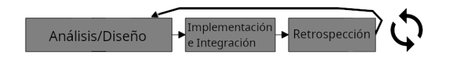

---

# Descripción Técnica

## **Estrategia de Git y Pipeline CI/CD**

La rama principal del repositorio utiliza una pipeline de Integración Continua/Entrega Continua (CI/CD) que compila el proyecto y lo despliega en AWS.
Esta estrategia nos permite reflejar el estado actual de la rama principal en todo momento.

Inicialmente, teníamos la idea de tener dos entornos de despliegue, pero debido a costes y debugging no previsto, solo hemos desplegado uno.

En el entorno local, se tenían las ramas de características (o features) a desarrollar. Una vez completada la feature, se hacía merge (en local) haciendo squash de todos los commits en la rama dev.

Para mantener actualizada una rama de características que había perdido sincronización con la rama dev, utilizábamos git rebase en el entorno local.

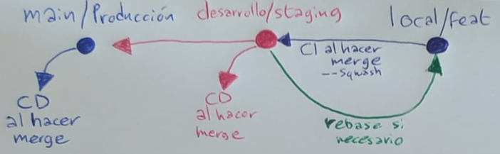

---

## **Arquitectura de la aplicación**

**Capa de presentación:** Una SPA con ReactJS y React Admin para una interfaz de usuario fluida e integración sencilla con la API REST.

**Capa de negocio:** Node.js con ExpressJS para construir la API REST, y Jest y Supertest para pruebas unitarias.

**Capa de datos:** PostgreSQL como gestor de base de datos relacional, Sequelize como ORM.

Docker para empaquetar componentes en contenedores independientes y despliegue en la nube de AWS para aprovechar CI/CD y escalado.

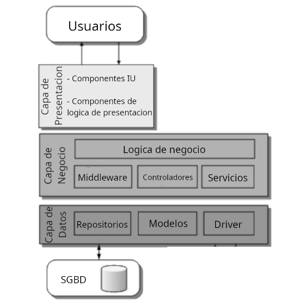

---

## **Tecnologías Utilizadas**

| Frontend                                                            | Backend                                                                                                                                                 | Testing                                              | Transversal                              |
| ------------------------------------------------------------------- | ------------------------------------------------------------------------------------------------------------------------------------------------------- | ---------------------------------------------------- | ---------------------------------------- |
| [React](https://reactjs.org/)                                       | [Express](http://expressjs.com/)                                                                                                                        | [Jest](https://jestjs.io/es-ES/)                     | [Day.js](https://day.js.org/)            |
| [React Admin](https://github.com/marmelab/react-admin)              | [Sequelize](https://sequelize.org/)                                                                                                                     | [Supertest](https://www.npmjs.com/package/supertest) | [tslib](https://www.typescriptlang.org/) |
| [Material-UI](https://mui.com/)                                     | [sequelize-crud](https://github.com/lalalilo/express-crud-router-sequelize-v6-connector)                                                                | [Axios](https://axios-http.com/es/docs/intro)        | [Terraform](https://terraform.io)        |
| [react-dom](https://reactjs.org/)                                   | [sequelize-schema-crud](./sequelize-schema-connector/package.json)                                                                                      |                                                      |                                          |
| [react-big-calendar](https://github.com/jquense/react-big-calendar) | [express-crud-router](https://github.com/lalalilo/express-crud-router)                                                                                  |                                                      |                                          |
| [simpleRestProvider](https://github.com/marmelab/react-admin)       | [crypto-js](http://github.com/brix/crypto-js), [cors](https://github.com/expressjs/cors), y [cookie-parser](https://github.com/expressjs/cookie-parser) |                                                      |                                          |
|                                                                     | [pg](https://github.com/brianc/node-postgres)                                                                                                           |                                                      |                                          |

---

# Diseño

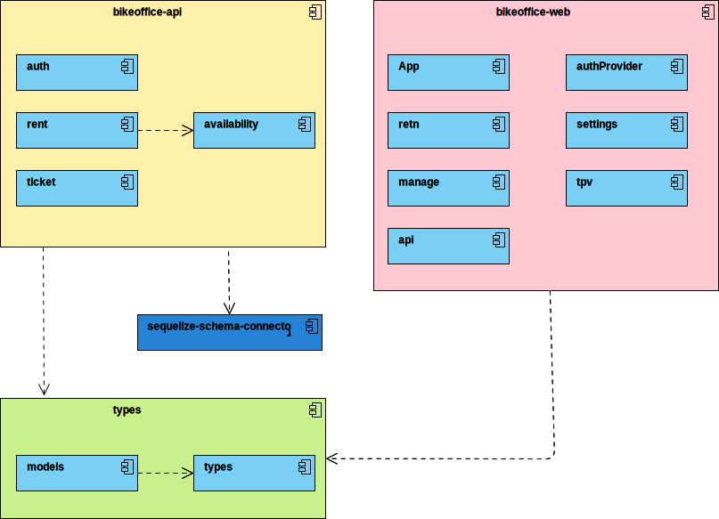

## Componentes

-   **`bikeoffice-api`** alberga rutas, middlewares, servicios y repositorios y que recibe las peticiones del bikeoffice-web
-   **`bikeoffice-web`** interractua con el usuario y se encarga de representar datos sacados por el bikeoffice-api
-   **`types`** posee las entidades que representan los modelos guardados en la BBDD, ademas de sus tipos correspondientes
-   **`sequelize-schema-connector`** libreria custom creada para interractuar con peticiones de react-admin a travez de un schema de la BD en concreto

## Esquema BBDD

# User Story: Alquiler y Venta

## Login

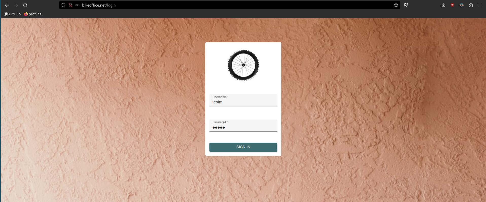

## Creacion Alquiler

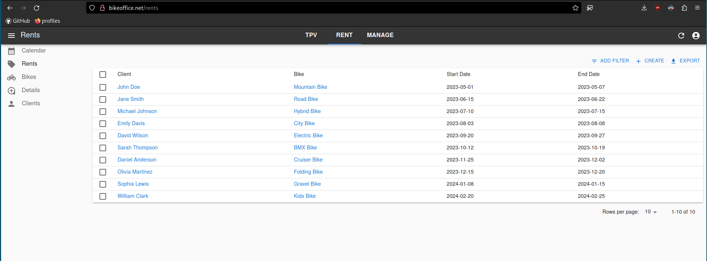
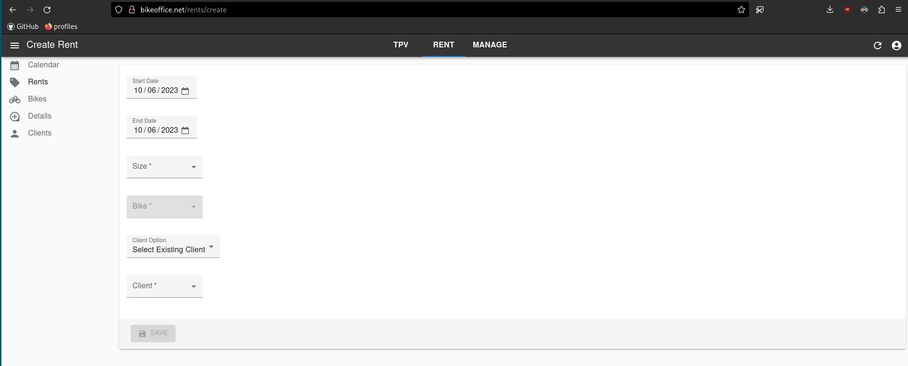
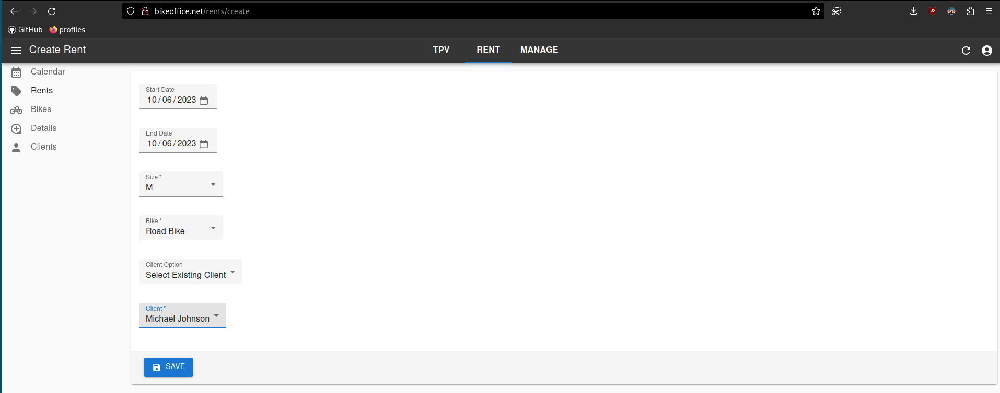

## Cobrar Alquiler y Productos

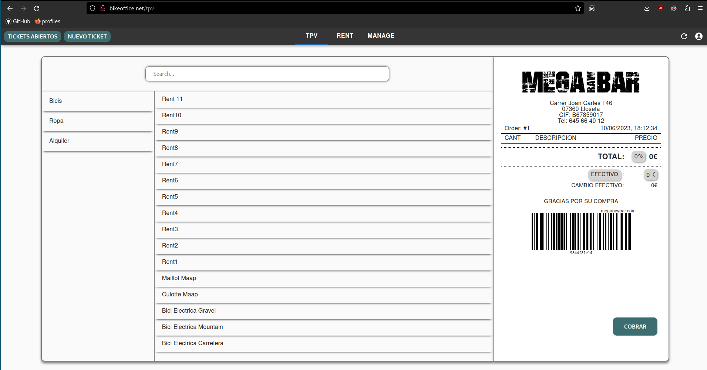
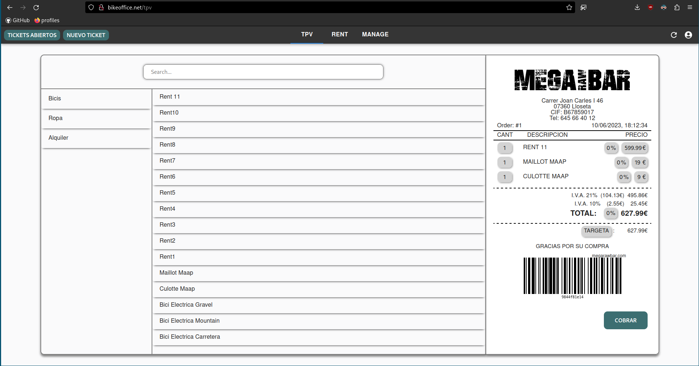

## Visualizacion Venta

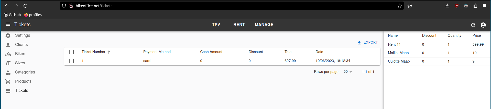

# **Comparación Temporal**

## **Clockify**

Para tener bajo control el tiempo utilizado y para poder comparar nuestras estimaciones hemos usado la herramienta Clockify con las siguientes etiquetas:

-   **Deploy:** Para la configuración de Terraform, github actions y AWS
-   **Refactor:** Para el rediseno y limpieza de la arquitectura
-   **TPV:** Para el desarrollo del modulo de TPV y ticket, tanto en el bikeoffice-api como el bikeoffice-web
-   **Rent:** Para el desarrollo del modulo de Rent y availability, tanto en el bikeoffice-api como el bikeoffice-web
-   **Setup:** Para la configuración inicial del proyecto (git, entornos, nx)
-   **Docs:** Para el tiempo usado para escribir esta documentación
-   **Test:** Para configuración y desarrollo de los tests
-   **Rent-TPV Merge:** Para la union de los modulos de TPV y Rent, que desarrollamos por separado

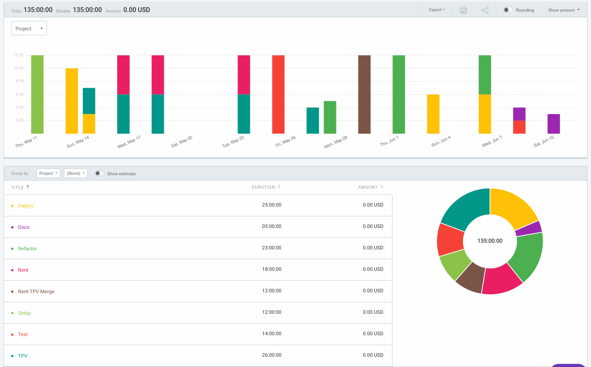

Nuestra limitación temporal fue de 135 horas.
Nuestra predicción temporal fue de 135 horas igual, para todos los modulos.
El resultado ha sido xx horas para 2 modulos, ya que no hemos contado que el despliegue y diseno de UI y UX nos hubiese relentizado tanto.

```yaml
Predicción de Tiempo: 135h

Tiempo Real: xxxh
```
